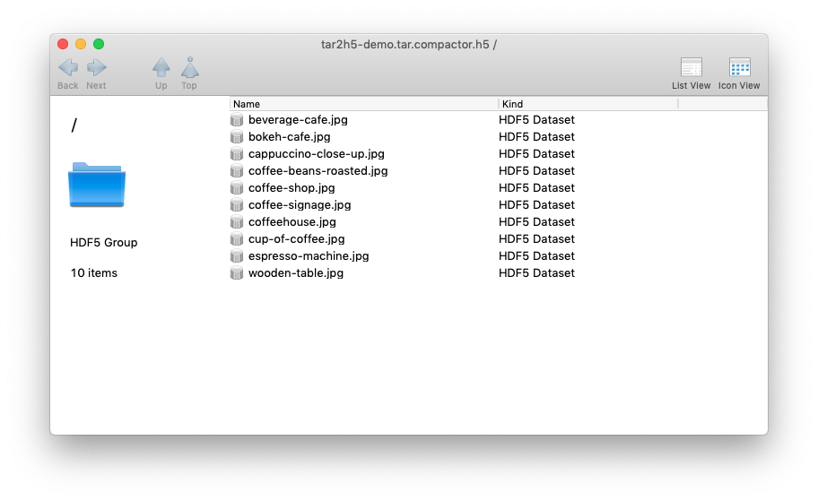
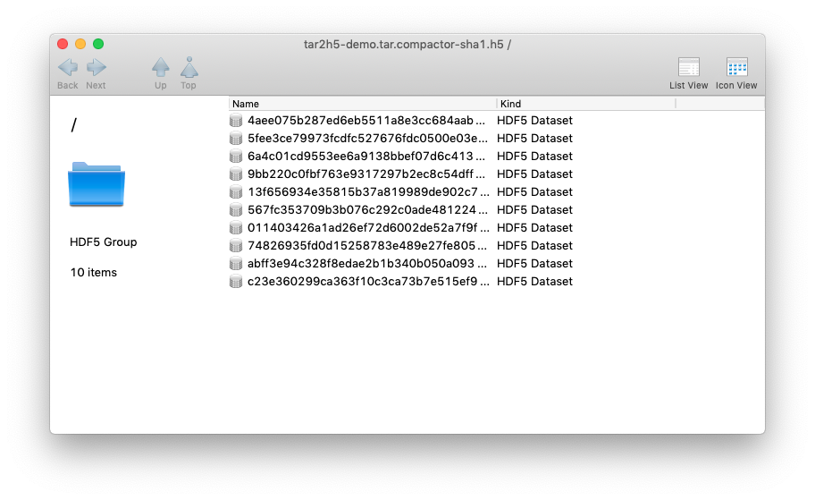
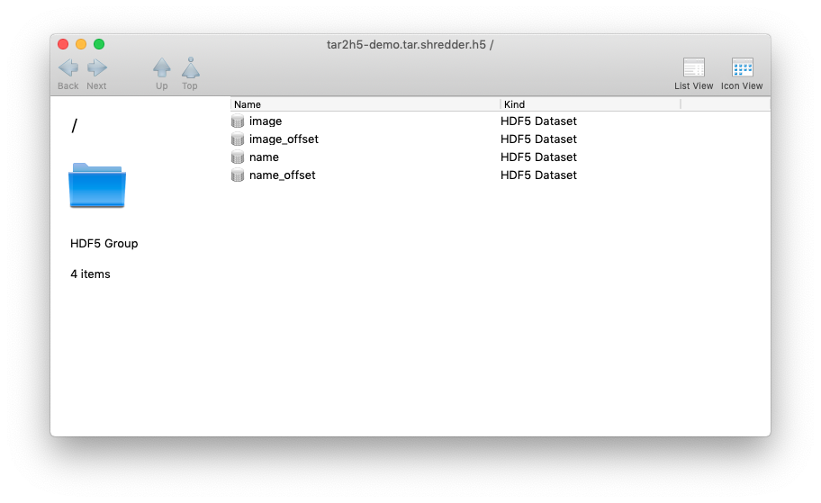

# tar2h5
Convert Tape ARchives to HDF5 files

* archive_checker
    ```check how many files can be extracted from the input tar file.```
* archive_checker_64k
    ```check if any files within input tar files larger than 64 KB.```
* h5compactor
    ```convert input tar file into hdf5 file, all files within tar file should smaller than 64KB, using small files name as dataset names.```
* h5compactor-sha1
    ```convert input tar file into hdf5 file, all files within tar file should smaller than 64KB, using small files sha1 values as dataset names.```
* h5shredder
    ```convert input tar file into hdf5 file, no file size limitation, concatenate data and offsets into 4 seperate arrays for better randomized access.```

## Install dependent packages (on Ubuntu-20.04-LTS)

* hdf5
``` 
sudo apt install libhdf5-103 libhdf5-dev libhdf5-openmpi-103 libhdf5-openmpi-dev
```
* libarchive
```
sudo apt install libarchive13 libarchive-dev
```      
* cmake
```
sudo apt install cmake
```
* openmpi
```
sudo apt install libopenmpi3 libopenmpi-dev openmpi-bin
```
* libssl
```
sudo apt install libssl1.1 libssl-dev 
```

## Install tar2h5 software

```bash
git clone https://github.com/HDFGroup/tar2h5.git
cd tar2h5
cmake .
make
```

## Uninstall tar2h5 software
```bash
make clean
```

## Run CTest
```bash
ctest
```

## Run tar2h5 software
```bash
./bin/archive_checker ./demo/tar2h5-demo.tar
./bin/archive_checker_64k ./demo/tar2h5-demo.tar
./bin/h5compactor ./demo/tar2h5-demo.tar
./bin/h5compactor-sha1 ./demo/tar2h5-demo.tar
./bin/h5shredder ./demo/tar2h5-demo.tar
```

## Visualization with HDFCompass
```bash
https://support.hdfgroup.org/projects/compass/
```

## Output File Format
* `compactor` Output Sample

* `compactor-sha1` Output Sample

* `shredder` Output Sample

